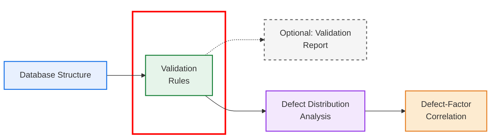

# Data_validation

## Project overview

The diagram below provides an overview of the project workflow, which is organized into four main steps and one optional component. This repository corresponds to the data validation steps, highlighted in red in the figure.

This repository performs validation of the data used in the sewer defect analysis. It consists of two main processes. On one hand, a validation report is generated to identify potential errors and inconsistencies. On the other hand, pipe properties are validated using a set of validation rules.
