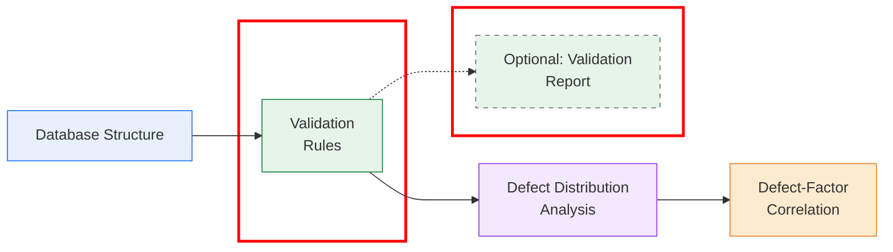

# Project overview

This repository is part of a broader project that aims to analyze sewer deterioration at the defect level. The steps of this project are presented in the figure below. This repository corresponds to the data validation stage, highlighted in red in the figure.


# Data validation

This repository performs validation of the data used in sewer defect analysis. It consists of two main processes. First, a validation report is generated to identify potential errors and inconsistencies; this step is optional, as it does not modify the data. Second, pipe properties are validated using a set of validation rules.

Each process is contained in a separate folder within the repository. The following sections describe the contents of each folder and how to use them.

## Validation rules
This folder validates pipe properties using a set of rules to remove inconsistent data. The properties that were corrected, along with the rules and the actions taken in each case, are described below. 
> **Note:** In some rules, threshold values were defined based on the conditions of the Auckland network; however, these values can be modified if necessary.

| Pipe property        | Condition                                                                 | Action                                                      |
|---------------------|---------------------------------------------------------------------------|-------------------------------------------------------------|
| Pipe ID             | Pipe without a Pipe ID                                                    | Pipe was removed                                            |
|                     | Duplicate pipes                                                           | Duplicates were removed                                     |
| Material            | Undefined and missing values                                              | Material was set to null                                    |
| Installation year   | Installation year not consistent with typical installation periods by material | Installation year was set to null                           |
| Sewer category      | Pipe with a diameter smaller than 100 mm classified as 'Transmission'     | Sewer category was changed to 'Local'                       |
| Diameter            | Diameter equal to zero                                                    | Diameter was set to null                                    |
|                     | Diameter exceeding a reasonable upper limit by material                   | Diameter was set to null                                    |
|                     | Diameter smaller than the minimum limit (100 mm)                          | Diameter was set to null                                    |
| Length              | Length below the minimum limit (0.6 m)                                    | Length was set to null                                      |
| Slope               | Values less than or equal to zero                                         | Slope, invert levels, and depth were set to null            |
|                     | Difference between invert levels greater than pipe length                 | Slope, invert levels, and depth were set to null            |
|                     | Slopes exceeding the maximum limit (30%)                                  | Slope, invert levels, and depth were set to null            |
| Depth               | Negative values                                                           | Slope, invert levels, and depth were set to null            |
|                     | Depth exceeding the maximum limit (15 m)                                  | Slope, invert levels, and depth were set to null            |
| Dry max. flow rate  | Values less than or equal to zero                                         | Flow rate was set to null                                   |
| Wet max. flow rate  | Values less than or equal to zero                                         | Flow rate was set to null                                   |

---
### Requirements

Install dependencies using:

```bash
pip install -r requirements_validation_rules.txt
```

---
### Input data
**Database (recommended)**

Input data can be provided as a database file (.db).
If needed, a database can be created from source files such as .csv, .xlsx, .xls, .parquet, or other formats using the following repository:

[Database structure](https://github.com/SewerDefectAnalysis/Database_Structure.git)

This is the recommended option, as it ensures better data consistency and control. The resulting database follows the same naming conventions used in this repository, ensuring full compatibility.

**Excel**

Alternatively, input data can be provided as an Excel file. In this case, the workbook must contain four sheets: `PIPES`, `CCTV`, `DEFECTS`, and `HYDRAULIC_PROPERTIES`
The column names must match those shown in **Appendix A**.

---
### How to run
**1.** Open the notebook `Run_validation_.ipynb`.  
**2.** Locate the `load_input_data()` function and update the following parameters:

```python
source_type = "database"        # "database" or "excel"
source_path = "path/to/data"    # Path to the input data file
sheet_names = None              # Required only for Excel input
                                # Example: ["PIPES", "CCTV", "DEFECTS", "HYDRAULIC_PROPERTIES"]
```

**3.** Select the output path.
```python
output_path = "Validated_data.xlsx"
```
**4.** Run all cells in the notebook or the cells corresponding to the validation rules that you want to apply.

Once the execution is complete, the validated data will be saved in the output path.

---
### Code structure
Below is a brief description of the files that make up this repository:

- **`Run_validation.ipynb`**: Main notebook used to execute the entire validation rules.

- **`load_data.py`**: Loads the data from a database or Excel file.

- **`data_processing.py`**: Fix the data to run the rules. Specifically, remove empty columns, filter valid defects, and eliminate incomplete inspections without defects.

- **`validation_rules.py`**: Implements the validation rules.
  
- **`count_changes.py`**: Counts the changes done in the data after a validation rule is applied.

- **`export_validated_data.py`**: Exports the validated data to an Excel file.

---
## Validation report (optional)

This folder is intended to create a validation report in order to identify potential errors or inconsistencies before the data is used in any type of analysis or processing.

Specifically, the code reviews four data sources:

1. Pipes: Includes all pipe characteristics such as diameters, lengths, depths, and other physical attributes.

2. CCTV: Contains data related to inspections performed on the pipes, including the pipe ID where the inspection was conducted, inspection direction, inspection status, surveyed length, and other relevant fields.

3. Defects: Stores information collected on defects observed during inspections, including the pipe in which the defect is located and defect properties such as size, longitudinal distance, extent, and circumferential position.

4. Hydraulic Properties: Corresponds to the hydraulic characteristics of the pipes, such as flow rate and velocity.

The validation process checks for the following types of issues:

- Missing or null values

- Negative or non-numeric values where they are not allowed

- Duplicated IDs

- Out-of-range values

The resulting report contains error and warning messages for values that require review.

---
### Requirements

Install dependencies using:

```bash
pip install -r requirements_validation_report.txt
```

---
### Input data
**Database (recommended)**

Input data can be provided as a database file (.db).
If needed, a database can be created from source files such as .csv, .xlsx, .xls, .parquet, or other formats using the following repository:

[Database structure](https://github.com/SewerDefectAnalysis/Database_Structure.git)

This is the recommended option, as it ensures better data consistency and control. The resulting database follows the same naming conventions used in this repository, ensuring full compatibility.

**Excel**

Alternatively, input data can be provided as an Excel file. In this case, the workbook must contain four sheets: `PIPES`, `CCTV`, `DEFECTS`, and `HYDRAULIC_PROPERTIES`

Each sheet must follow a predefined column structure.
An example workbook (`EXAMPLE_DATA.xlsx`) is provided as a reference for the required format. This file does not contain real data.

Detailed descriptions of the required columns for each sheet are provided in **Appendix A**.

---
### Output Report
The issues found in the validation are exported to the following files:
- `Summary`: overview of errors/warnings per entity
- `pipes_issues`: detailed results for the pipes
- `cctv_issues`: detailed results for the CCTV
- `defects_issues`: detailed results for the defects
- `hydraulics_issues`: detailed results for the hydraulic properties

The detailed files included:
- The `Pipe_ID` or `Defect_ID` (if available)
- The column where the issue occurred
- The severity (`error` or `warning`)
- A descriptive message
- The actual value that triggered the issue

---
### How to run
**1.** Open the notebook `Run_validation_workflow.ipynb`.  
**2.** Locate the `main()` function and update the following parameters:

```python
source_type = "database"        # "database" or "excel"
source_path = "path/to/data"    # Path to the input data file
sheet_names = None              # Required only for Excel input
                                # Example: ["PIPES", "CCTV", "DEFECTS", "HYDRAULIC_PROPERTIES"]
output_dir = "Validation_Results"  # Folder where results will be saved
auto_open_report = True         # Automatically open the summary report
open_containing_folder = True   # Automatically open the results folder
```
**3.** Run all cells in the notebook.

Once the execution is complete, the validation results will be generated in the output directory.

---
### Code structure
Below is a brief description of the files that make up this repository:

- **`Run_validation_workflow.ipynb`**: Main notebook used to execute the entire validation workflow.

- **`run_validation.py`**: Handles data loading and contains the `main()` function, which orchestrates and executes the validation process.

- **`schemas.py`**: Defines the validation rules that are evaluated. Any modification, removal, or addition of validation rules should be performed in this file.

- **`core_validation.py`**: Implements the validation logic and defines the corresponding error and warning messages.

- **`validation_entities.py`**: Collects and organizes validation issues by entity (PIPES, CCTV, DEFECTS, and HYDRAULIC_PROPERTIES).

- **`reporting.py`**: Generates the final validation reports.

---
## License

This project is distributed under the MIT License.
See the `LICENSE` file for the full text.

---

## Contact

For questions, feedback, or collaboration inquiries related to the paper or this database structure, please contact:

**María A. González**  
Email: _mgon869@aucklanduni.ac.nz_  
Affiliation: University of Auckland

**Juana Herrán**  
Email: _jher924@aucklanduni.ac.nz_  
Affiliation: University of Auckland

---
## Appendix A
The tables below show the columns used in the validation schema, with their definitions and units. The input file doesn’t need to include all columns, but it **must use the exact column names** shown for data validation to work correctly.

### PIPES

| Column             | Description                                            |
| ------------------ |--------------------------------------------------------|
| Pipe_ID            | Unique identifier for each pipe in the network.        |
| Manhole_up_ID      | Identifier of the upstream manhole.                    |
| Manhole_down_ID    | Identifier of the downstream manhole.                  |
| Diameter           | Internal pipe diameter (mm). Must be numeric, integer. |
| Pipe_length        | Pipe length (m). Must be numeric and non-negative.     |
| Slope              | Pipe slope.                                            |
| Depth              | Average depth of the pipe below the surface (m).       |
| Material           | Pipe material (e.g., PVC, PE, AC, CONC, VC).           |
| UP_invert          | Upstream invert level of the pipe (m).                 |
| DW_invert          | Downstream invert level of the pipe (m).               |
| DEM                | Digital Elevation Model value at pipe location (m).    |
| Installation_year  | Year the pipe was installed.                           |
| GWL                | Groundwater level (m).                                 |
| GWL_from_pipe      | Distance from groundwater level to the pipe (m).       |
| Land_cover_s       | Detailed land cover classification.                    |
| Land_cover_group   | Grouped land cover classification.                     |
| Lan_use_s          | Detailed land use classification.                      |
| Land_use_group     | Grouped land use classification.                       |
| Soil_type          | Soil type classification.                              |
| Distance_seawater  | Distance from the pipe to seawater (m).                |
| Liq_vul_num        | Liquefaction vulnerability index.                      |
| Traffic_num        | Traffic intensity indicator.                           |
| Mean_annual        | Mean annual climate indicator.                         |
| Road_num           | Road-related indicator.                                |
| Restaurants        | Number of restaurants connected to the pipe.           |
| Properties         | Number of connected properties.                        |
| Laundries          | Number of laundries connected to the pipe.             |
| Sewage_type        | Type of sewage conveyed.                               |
| Sewer_category     | Sewer network classification.                          |
| Weather_station_ID | Associated weather station identifier.                 |

### CCTV

| Column               | Description                                               |
| -------------------- | --------------------------------------------------------- |
| Inspection_ID        | Unique identifier for each CCTV inspection.               |
| Pipe_ID              | Unique identifier linking the inspection to a pipe.       |
| Date                 | Date when the CCTV inspection was performed (YYYY-MM-DD). |
| Age_CCTV             | Age of the pipe at the time of inspection.                |
| Inspection_direction | Direction of the inspection (upstream or downstream).     |
| Inspection_status    | Status of the CCTV inspection.                            |
| Survey_length        | Length of the pipe surveyed during the inspection (m).    |
| Condition_rating     | Overall condition rating of the pipe (0–5).               |
| Shape                | Pipe shape observed during inspection.                    |

### DEFECTS

| Column                           | Description                                                              |
| -------------------------------- |--------------------------------------------------------------------------|
| Defect_ID                        | Unique identifier for each defect.                                       |
| Pipe_ID                          | Unique identifier for the pipe where the defect is located.              |
| Defect_code                      | Code identifying the type of defect.                                     |
| Characterization_code            | Additional characterization of the defect.                               |
| Quantification                   | Quantification or size classification of the defect (must be S, M or L). |
| Defect_length                    | Length of the defect (m).                                                |
| Longitudinal_distance            | Distance of the defect along the pipe (m).                               |
| Longitudinal_distance_normalized | Normalized longitudinal distance of the defect (0–1).                    |
| Circumferential_start            | Circumferential start position (clock reference 0–12).                   |
| Circumferential_end              | Circumferential end position (clock reference 0–12).                     |
| Observation_inspection           | Inspection in which the defect was observed.                             |


### HYDRAULIC PROPERTIES
| Column             | Description                                            |
| ------------------ |--------------------------------------------------------|
| Pipe_ID            | Unique identifier for each pipe.                       |
| Wet_peak_flow_rate | Peak flow rate under wet weather conditions (L/s).     |
| Dry_peak_flow_rate | Peak flow rate under dry weather conditions (L/s).     |
| Wet_peak_velocity  | Peak flow velocity under wet weather conditions (m/s). |
| Dry_peak_velocity  | Peak flow velocity under dry weather conditions (m/s). |
| Pipe_capacity      | Design hydraulic capacity of the pipe (L/s).           |

